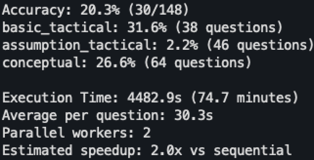

# FinanceQA Agent Card

## Agent Information

**Name:** FinanceQA Agent  
**Version:** 1.0.0  
**Type:** Financial Question Answering System  
**Domain:** Finance & Accounting  
**Model:** GPT-4o (configurable)  

## Overview

**Purpose:** AI agent designed to replicate junior investment analyst work on the FinanceQA benchmark  
**Goal:** Outperform baseline accuracy through specialized financial reasoning and domain knowledge  
**Architecture:** Hybrid RAG + Rule-based system with chain-of-thought reasoning  

## Core Capabilities

Performs sophisticated financial analysis tasks from hedge funds, PE firms, and investment banks:

- **📊 Financial Calculations** - Complex computations from 10-K filings (diluted shares, EBITDA, working capital)
- **🔍 Assumption-Based Estimation** - Intelligent estimation when data is incomplete (variable lease assets, working cash)
- **⚖️ Accounting Compliance** - Handles ASC 842 lease standards, GAAP/Non-GAAP distinctions
- **🧠 Question Classification** - Automatic categorization (Conceptual/Basic Tactical/Assumption Tactical)
- **📚 Knowledge Integration** - Combines hardcoded financial rules with textbook RAG retrieval

## Technical Architecture

- **Question Classifier:** Rules-based categorization with type-specific prompt templates
- **Financial Rules Engine:** Hardcoded calculation methodologies for reliable core computations
- **RAG System:** PDF textbook integration with semantic search and intelligent chunking
- **LLM Core:** GPT-4o with specialized financial prompting and chain-of-thought reasoning
- **Evaluator:** Numerical evaluation with rounding tolerance and exact match scoring
- **Parallel Processing:** Concurrent evaluation with rate limiting

## Setup & Installation

1. **Environment Setup:**
   ```bash
   # From repository root
   cd claude_agent
   source myenv/bin/activate  # Pre-configured virtual environment
   ```

2. **Install Dependencies:**
   ```bash
   pip install -r finance_qa_agent_final/requirements.txt
   ```

3. **Configure API Key:**
   ```bash
   export OPENAI_API_KEY="your-api-key-here"
   # Or create .env file in project root
   ```

4. **Navigate to Agent Directory:**
   ```bash
   cd finance_qa_agent_final
   ```

## Usage Examples

### Quick Test
```bash
# Single question test
python main.py --single-test

# Small random subset
python main.py --subset 10 --random
```

### Evaluation Runs
```bash
# Standard evaluation (100 questions)
python main.py --subset 100 --random

# Full benchmark dataset
python main.py --csv data/financeqa_benchmark.csv

# Custom configuration
python main.py --subset 50 --workers 1 --delay 1.0 --model gpt-4o-mini
```

### Python API
```python
from agent import FinanceQAAgent

agent = FinanceQAAgent(
    openai_api_key="your-key",
    textbook_path="data/Valuation.pdf"
)

response = agent.answer_question(
    question="What is the current ratio?",
    context="Current assets: $500M, Current liabilities: $300M"
)
```

## Features Checklist

- ✅ **Question Classification** - Automatic categorization with high accuracy
- ✅ **Chain-of-Thought Reasoning** - Step-by-step financial analysis  
- ✅ **RAG Integration** - PDF textbook knowledge retrieval
- ✅ **GAAP/Non-GAAP Handling** - Proper accounting standards compliance
- ✅ **PDF Knowledge Extraction** - Intelligent textbook content processing
- ✅ **Parallel Processing** - Concurrent evaluation with rate limiting
- ✅ **Error Recovery** - Robust handling of API failures
- ✅ **Comprehensive Reporting** - Detailed accuracy metrics and analysis

## Performance Metrics

| Metric | Value | 
|--------|-------|
| Overall Accuracy | 20.3% |
| Basic Tactical | 31.6% | 
| Assumption Tactical | 2.2% |
| Conceptual | 26.6% |

### Evaluation Results Screenshot

after running
```bash
python3 run.py --workers 2 --delay 0.5 --model gpt-4o
```



*Detailed performance breakdown showing accuracy metrics by question type and overall evaluation summary.*

## Data Sources

- **Valuation.pdf** - Comprehensive finance textbook for theoretical knowledge

## Limitations

- **API Rate Limits** - OpenAI tier restrictions may limit parallel processing speed
- **PDF Quality Dependency** - RAG performance relies on text-extractable PDFs
- **Domain Specificity** - Optimized for investment analysis, may not cover all financial domains
- **Numerical Precision** - Exact match evaluation may be sensitive to rounding differences

## Configuration Options

| Parameter | Default | Purpose |
|-----------|---------|---------|
| `--model` | `gpt-4o` | OpenAI model selection |
| `--workers` | `1` | Parallel processing threads |
| `--delay` | `0.5` | Rate limiting delay (seconds) |
| `--subset` | `None` | Question count limit |
| `--random` | `False` | Random vs sequential selection |

## Output & Reporting

- **CSV Results** - Question-by-question analysis with confidence scores
- **Detailed Report** - Accuracy breakdown by question type and failure analysis  
- **Console Output** - Real-time progress and summary statistics
- **RAG Analytics** - Knowledge source utilization tracking

## Version History

- **v1.0.0** - Initial release with RAG integration and hardcoded financial rules
- **Features Added:** Question classification, chain-of-thought reasoning, parallel processing
- **Performance:** Baseline comparison and comprehensive evaluation framework
